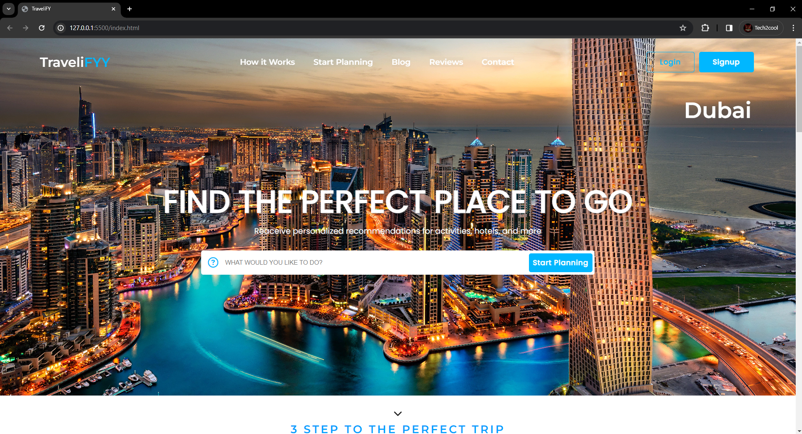
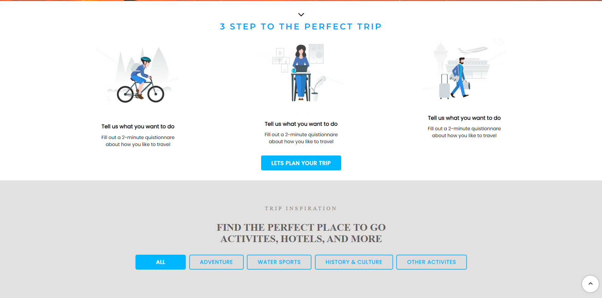
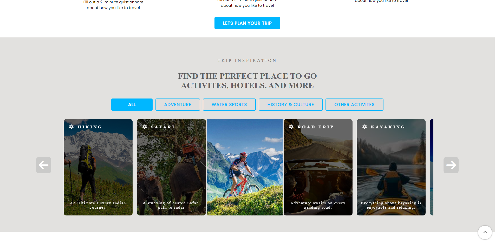
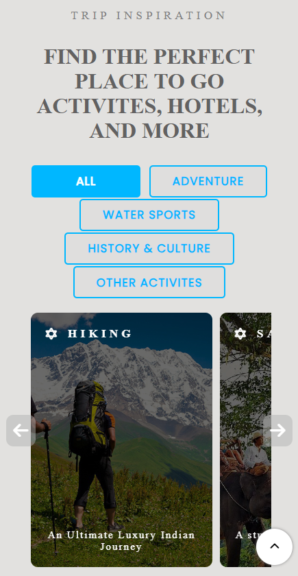

  
  <h2 align="center">TraveliFYY - Travel website</h2>

  TraveliFYY is fully responsive travel website,  Responsive for all devices, built using HTML, CSS, and JavaScript.

  <a href="https://tech2cool.github.io/TraveliFYY-Travel-Website/"><strong>➥ Live Demo</strong></a>

 
### Demo Screeshots

### License

This project is **free to use** and does not contains any license.