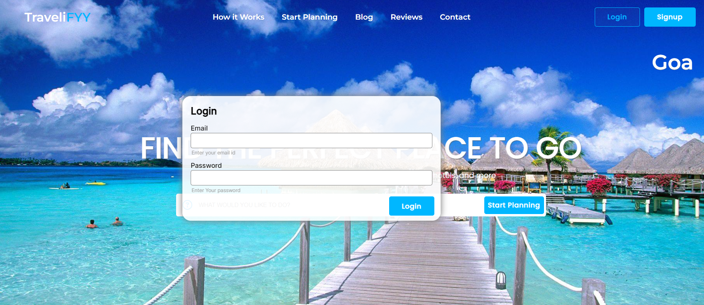
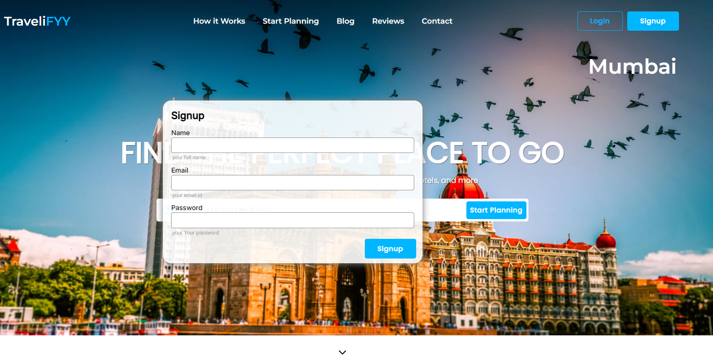

  
  <h2 align="center">TraveliFYY - Travel website</h2>

  

  TraveliFYY is fully responsive travel website, 
   Responsive for all devices, built using HTML, CSS, and JavaScript.
   Aswell as some basic animations.
  <li align="center">Responsive design</li>
  <li align="center">Responsive Image Slider</li>
  <li align="center">Floating Login/Signup Section</li>
  <li align="center">Thank you message for submitting form.</li>
  <li align="center">Survey Form(travel/personal details/etc)</li>

  <a href="https://tech2cool.github.io/TraveliFYY-Travel-Website/"><strong>➥ Live Demo</strong></a>

 

### Demo Screeshots

### Desktop

### Login/Signup Box

### Android/Phone

### License

This project is **free to use** and does not contains any license.